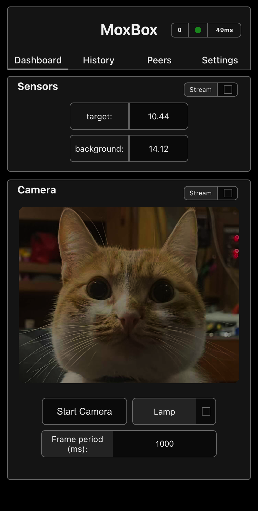
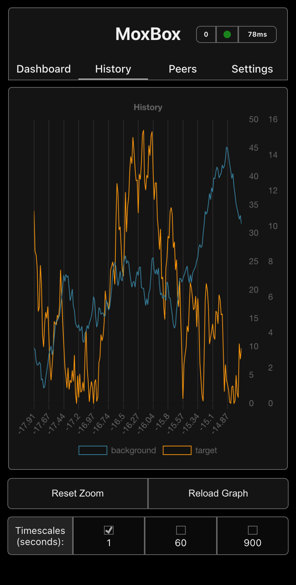
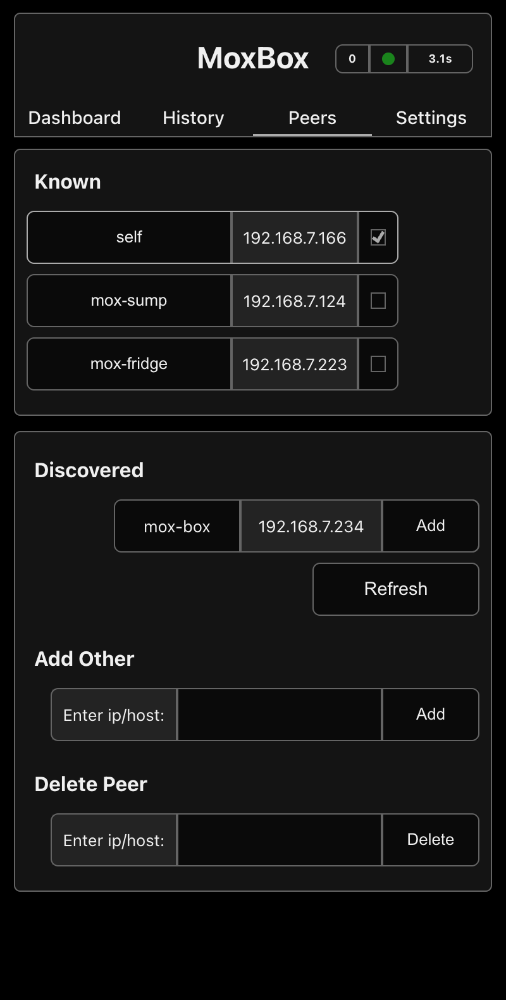
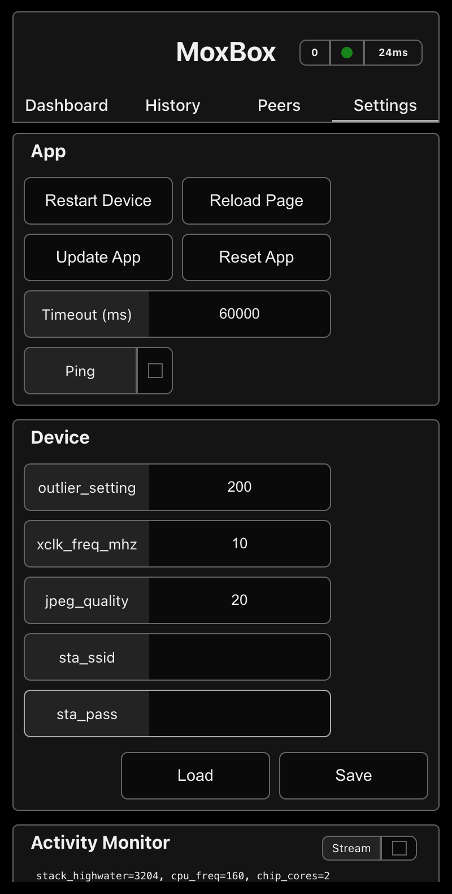
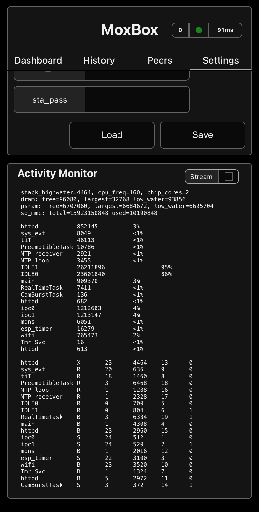

<!-- Improved compatibility of back to top link -->
<a id="readme-top"></a>

<!-- PROJECT LOGO -->
<br />
<div align="center">

<h3 align="center">MoxBox</h3>




<p align="center">
Esp32 camera/datalogger + react portable web app
</p>
</div>

<!-- TABLE OF CONTENTS -->
<details>
  <summary>Table of Contents</summary>
  <ol>
    <li><a href="#moxbox">Moxbox</a></li>
    <li>
      <a href="#getting-started">Getting Started</a>
    </li>
    <li>
        <a href="#usage">Usage & Technical Details</a>
        <ul>
            <li><a href="#dashboard">Dashboard</a></li>
            <li><a href="#history">History</a></li>
            <li><a href="#peers">Peers</a></li>
            <li><a href="#settings">Settings</a></li>
            <li><a href="#ota">OTA Updates</a></li>
            <li><a href="#ssl">Generating SSL certs manually</a></li>
        </ul>
    </li>
    <li><a href="#todo">Todos</a></li>
    <li><a href="#license">License</a></li>
    <li><a href="#contact">Contact</a></li>
  </ol>
</details>


## MoxBox
MoxBox is a react webapp and esp32 firmware for data logging, and camera streaming.  Use it as is or as boilerplate for your own projects.

Key Features:
- SSL certs generated and stored on device.
- Dual mode wifi AP+STA to install pwa and provision wifi
- mDNS discovery for connecting to all your moxboxes
- Service worker caching of all assets and data in browser.
- Activity monitor for device stats and task timings

<br/>

<p align="right">(<a href="#readme-top">back to top</a>)</p>

## Getting Started

Before installing, take a look at defines.h to get an idea of what features you will want to enable/disable.  If you're data-logging you can also look at realtime_ops.h to setup your moxbox inputs.  

### Installation

1. Build the frontend
   ```sh
   cd frontend
   npm install
   ./build.sh
   ```
2. Flash with esp-idf
   ```sh
   idf.py build flash monitor
   ```
4. Connect to the esp32's softAP.  The ssid is moxbox-[device mac], password is 1234567890.
5. Open http://moxbox.local/certificates Use this page to generate a rootca, download it, and restart the device
6.  Add the certificate to your truststore to enable service workers and cors requests in the webui
7. Open webapp at https://moxbox.local, and add to your homescreen to install.  
8.  Be patient - the initial page load will pull the >200KB webapp from the esp32 and can sometimes take 10-20s.  After a refresh, the serviceworker will cache the app.

If you want to use a single rootca for multiple moxbox devices, see: <a href="#ssl">Generating SSL certs manually</a>

<br/>

<p align="right">(<a href="#readme-top">back to top</a>)</p>


## Usage and Technical Details

### Dashboard

The status bar at the top right of the UI shows you the number of inflight requests and the status (red/green) and elapsed time of the last one to finish.  This helps prevent a lot of frustration when your esp is innevitably a bit slow to respond.

If you've setup:
```code
#define FEATURE_REALTIME_TASK 
#define COLLECTED_DATA_NAMES {"target", "background"}
#define COLLECTED_DATA_COUNT 2
#define OVERSAMPLE_FACTOR 250
#define SAMPLE_INTERVAL_MS 250
#define DATA_IPC_INTERVAL_MS 500
```
In defines.h, you will see a readout of your sensors.  OVERSAMPLE_FACTOR provides averaging functionality within the sampling ISR, which helps with noisy data sources. SAMPLE_INTERVAL_MS and DATA_IPC_INTERVAL_MS are different incase you want to run a control loop at high granularity, but still only report data back to the UI and micro SD logging at a lower frequency so as not to overwhelm the system.

If you've set:
```code
#define FEATURE_CAMERA
```
you will be able to stream frames from OVxxxx series cameras.  Note that you'll need to manually start the camera after device restarts.

<br/>
<br/>

<p align="right">(<a href="#readme-top">back to top</a>)</p>


### History

If your setup includes:

```code 
#define FEATURE_MMC_LOGGING
```

Moxbox will log to a microsd card.  Logging occurs at multiple time scales defined in data_logger.h:

```code
{
    {.ms_per_row=1000, .mins_per_file=5, .discard_after_hrs=1, batch_writes=true}, 

    {.ms_per_row=60000, .mins_per_file=240, .discard_after_hrs=72, .batch_writes=false}, 

    {.ms_per_row=900000, .mins_per_file=4320, .discard_after_hrs=12720, .batch_writes=false}
};
```
With older data being eventually discarded, so as to allow a high resolution look at the recent past without filling cards too fast.  Batching is recommended for writes on timescales <1s.  Data is stored to the card in a series of text files for easy export.

<br/>

The webapp caches all data it receives, allowing for offline viewing and will update itself in the background when it can find your Moxbox.  This data is stored in IndexedDB, with fallbacks to WebSQL and localStorage, with the accordant max data size limitations and possibility of your device randomly deleting the data.

<br/>

<p align="right">(<a href="#readme-top">back to top</a>)</p>

### Peers

The peers tab allows you to connect to as many Moxboxes as you want from the client.  Moxboxes on your network will show up in the Discovered pane via mDNS lookup, and you can add them to your known hosts. You can also add them manually by either hostname or ip address, or remove peers.  You can use this to add peers on another subnet, or through an overlay network like tailscale/zerotier.  

<br/>
Click the checkbox next to one of your known peers to point the client at that one. All data requests from the client will now go to that host.  You can also change the nicknames of your known hosts to something more useful.

<br/>
When you set a new target, your origin will remain moxbox.local and requests will be cross origin.  On startup, moxbox uses its stored root ca to sign a new cert which contains IP records for both its softAP and station wifi interfaces to allow for tls verification of cross origin requests.  MoxBox's webserver uses the extremely liberal policy of returning the request Origin in the Access-Control-Allow-Origin header.

<br/>

If you have multiple MoxBoxes on a network, they will all compete over mDNS to serve moxbox.local.  This race seems to resolve into stable assignments of moxbox.local, moxbox-1.local, etc, with another host picking up moxbox.local if the primary goes down, but this could vary by network.

<br/><br/><br/>


<p align="right">(<a href="#readme-top">back to top</a>)</p>

### Settings

Device and Webapp settings, plus an activity monitor.




<br/><br/><br/><br/><br/><br/><br/><br/><br/><br/>
<br/><br/><br/><br/><br/><br/><br/><br/><br/><br/>
<br/><br/><br/><br/><br/><br/><br/><br/><br/><br/><br/><br/><br/><br/>

<p align="right">(<a href="#readme-top">back to top</a>)</p>

### OTA Updates
To send OTA firmware updates to your moxbox:
```sh
curl --progress-bar -X POST --data-binary @build/moxette.bin http://moxbox.local/ota_upload  | tee /dev/null
```
and to push a new webui:
```sh
curl --progress-bar -X POST --data-binary @build/assets.bin http://moxbox.local/ota_assets  | tee /dev/null
```

<br/>

<p align="right">(<a href="#readme-top">back to top</a>)</p>

<br/>

### Generating SSL certs manually
If you generate a rootca on your computer and include it in your project, you can reuse it on all your moxboxes to avoid needing to add a new trusted rootca for each one. 
```sh 
openssl req -x509 -newkey rsa:4096 -nodes -keyout root_ca.key -out root_ca.crt -sha256 -days 365 -subj "/CN=moxbox.local" -addext "subjectAltName=DNS:moxbox.local,DNS:www.moxbox.local"
"
```
Add these files to a folder called "certs" at the project root.
Uncomment the following line at the end of CMakeLists.txt:
```code
spiffs_create_partition_image(certs ../certs FLASH_IN_PROJECT)
```
and run:
```shell
idf.py build flash monitor
```
You can also update only the rootca OTA using:
```shell
curl --progress-bar -X POST --data-binary @build/certs.bin http://moxbox.local/ota_certs  | tee /dev/null
```

<br/>


<br/>

<p align="right">(<a href="#readme-top">back to top</a>)</p>

<br/>

## Todos
- [ ] data logging demo: memory pressure/idle timings
- [ ] Decimator should calculate more summary stats than just average
- [ ] mirror serial logging interface over websocket to client
- [ ] all endpoints available over both http and https
- [ ] fix ntp
- [ ] turn_off_camera endpoint/functionality
- [ ] rootca in hardware secure storage
- [ ] refactor ota endpoints
- [ ] refactor ssl_keygen

<br/>

<p align="right">(<a href="#readme-top">back to top</a>)</p>

<br/>

<!-- LICENSE -->
## License

Distributed under the GPL-V3 license in `LICENSE.md`.

<br/>

<p align="right">(<a href="#readme-top">back to top</a>)</p>

<br/>

## Contact

Leonidas Tolias 


<br/>

<p align="right">(<a href="#readme-top">back to top</a>)</p>

<br/>
